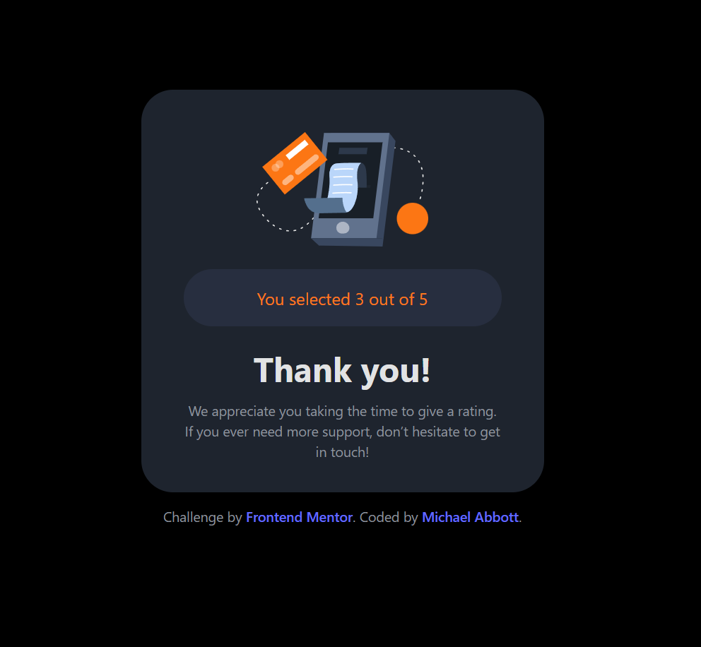

# Frontend Mentor - Interactive rating component solution

This is a solution to the [Interactive rating component challenge on Frontend Mentor](https://www.frontendmentor.io/challenges/interactive-rating-component-koxpeBUmI). Frontend Mentor challenges help you improve your coding skills by building realistic projects. 

## Table of contents

- [Overview](#overview)
  - [The challenge](#the-challenge)
  - [Screenshot](#screenshot)
  - [Links](#links)
- [My process](#my-process)
  - [Built with](#built-with)
  - [What I learned](#what-i-learned)
  - [Continued development](#continued-development)
- [Acknowledgments](#acknowledgments)


## Overview

### The challenge

Users should be able to:

- View the optimal layout for the app depending on their device's screen size
- See hover states for all interactive elements on the page
- Select and submit a number rating
- See the "Thank you" card state after submitting a rating

### Screenshot





### Links

- Challenge URL: [FrontendMentor.io](https://www.frontendmentor.io/challenges/interactive-rating-component-koxpeBUmI)
- GH Pages URL: [GH Pages](https://abbottmichael96.github.io/Review-Pane/)

## My process

### Built with

- TypeScript
- [React](https://reactjs.org/) - JS library
- [Styled Components](https://styled-components.com/) - For styles
- [Vite](https://vitejs.dev/) - For build


### What I learned

This challenge has been an excellent way for me to demonstrate my basic React skills. For example my use of state management can keep track of the user rating across pages. 

```js
const [selectedRating, setSelectedRating] = useState<Number>();

function ratingHandler(rating: number){
  setSelectedRating(rating);
}

<div className = {styles.buttongroup}>
  {[1,2,3,4,5].map((rating) =>(
      <button
      type="button"
      onClick={() => ratingHandler(rating)} className={styles.button}>
      {rating}
      </button>
  ))}
</div>
```

This allows me to track the state of the user answer for future usage

```js
<p className={styles.ratingOutOf5}> 
  You selected {selectedRating} out of 5
</p>
```

### Continued development

In the not so distant future I would like to be able to break these two views out into different components. 


## Acknowledgments

Thanks for looking!
